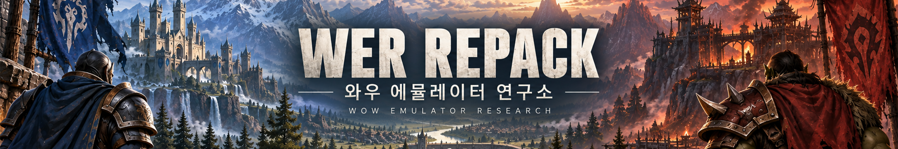

# WER Repack — WOW Emulator Research

[한국어](README.md) · **English**

**World of Warcraft: Wrath of the Lich King 3.3.5a / build 12340 / koKR / Windows x64**

WER stands for **WOW Emulator Research**, the name of 와우 에뮬레이터 연구소.
This is a Korean-localized research repack integrating AzerothCore, Playerbots, WOW Legends-based source and community modules.
WER credits the original developers; it is not an official Blizzard product or an affiliated service.
The banner's expansion cards do not indicate support for expansions other than this WotLK client.

> [!IMPORTANT]
> The existing **v1.1.0 Windows repack** was produced on **September 21, 2026**.
> The **October 9, 2026 source update** is newer than its executables and source ZIP.
> [Read the update and validation limits](docs/updates/2026-10-09-safety-review.en.md).
> Isolated world startup and 27 real protocol tests on the final executables have passed; graphical gameplay, sustained 2,000-bot load, live LLM and production readiness remain separate.

> **Source prerelease:** [v1.1.1-rc.1](https://github.com/hilch1981-prog/WER-Repack/releases/tag/v1.1.1-rc.1) · [Korean / English release notes](docs/releases/v1.1.1-rc.1.md).
> rc.1 remains source-only. **New runnable prerelease:** [v1.1.1-rc.2](https://github.com/hilch1981-prog/WER-Repack/releases/tag/v1.1.1-rc.2) · [release/validation notes](docs/releases/v1.1.1-rc.2.md) · [quick start](docs/INSTALL.rc2.md).
> rc.2 excludes game data: [extract from your own lawful client](docs/DATA_EXTRACTION.md). Existing stable v1.1.0 is preserved.

> [!WARNING]
> **🟨 Try NVIDIA-powered LLM bot conversations — a key WER feature.**
> Your own valid NVIDIA API key is required for external LLM conversations, **not for the basic server or ordinary bot AI**.
> Hosted inference does not require running a large model or a dedicated inference GPU on your PC.
> NVIDIA offers prototype endpoints, subject to account/model availability and terms; free access is not unlimited throughput or an uptime guarantee.
> [Get and configure your key](docs/NVIDIA_API.en.md) · [NVIDIA Build](https://build.nvidia.com/).

## Download the right package

- **New updated executable package:** rc.2 `WER_REPACK_VER.1.1.1-rc.2.zip`. Matching full source is a separate `WER_Source_v1.1.1-rc.2.zip`; game data is not bundled. Fresh-install prerelease, not a sustained-load certification or an in-place update.
- **Runnable server:** [v1.1.0 release](https://github.com/hilch1981-prog/WER-Repack/releases/tag/v1.1.0), asset **`WER_REPACK_VER.1.1.0.zip`**. Extract the complete ZIP into a new folder.
- **Source matching v1.1.0 executables:** that release's `WER_Source.zip` or the [v1.1.0 source tag](https://github.com/hilch1981-prog/WER-Repack/tree/v1.1.0/source/WER_Source).
- **Updated source:** [source/WER_Source](source/WER_Source). It includes the 19-file safety update; **it does not match the old executable ZIP byte-for-byte**.
- [Install, connect and shut down](docs/INSTALL.en.md) · [NVIDIA API configuration](docs/NVIDIA_API.en.md) · [Source/build guide](source/README.en.md).

GitHub's automatic **Source code ZIP is not a runnable repack**. Never overwrite an existing server folder or `mysql/data` with a fresh-install package.
No API key is supplied. The game client is not supplied; use a lawfully obtained matching client and respect the rights applicable to game data.

## Start three visible consoles

For the existing runnable v1.1.0 package, start in this order:

1. **`1_MYSQL.bat`** — initialize the fresh database on first use, then wait for `ready for connections`.
2. **`2_AUTHSERVER.bat`** — start the authentication server.
3. **`3_WORLDSERVER.bat`** — start the world server; first-time bot creation can take time.

Keep all three consoles open. Normal use does not require Python, a combined menu or a background watchdog.
Use the batch launchers instead of launching the EXEs directly. Shut down **world → auth → MySQL**, using Ctrl+C and waiting for completion.
Do not kill MySQL before the world saves, and do not delete its data directory when troubleshooting.

**Default game account: `admin / admin` (GM 3). Change it before exposing the server; do not share the GM account with ordinary players.**

## Features and configured policies

| Area | Included functions / policy |
|---|---|
| Korean localization | koKR data, bot/guild names and dialogue work, item/zone/pet locale handling, Korean startup branding |
| Playerbots | First-run random bot creation, target 2,000 online bots, party/raid and companion systems |
| Population | City life, outdoor PvP, city duels, Wintergrasp, random bot synchronization, partial guild membership |
| LLM chat | OpenAI-compatible hosted APIs such as NVIDIA, ordinary `/1` and `/s`, whispers, party, raid and guild channels |
| Group content | Dungeon Clear and Optimal Bot Raid support |
| Guild housing | Guild-specific purchase/use and flight-master travel menu; requires guild membership |
| Travel | Flight-path unlocks and flight/instant-travel menu features |
| Loot/quests | AoE loot, party quest loot assistance and quest radar |
| Economy | Auction-house bot, playerbot auction use and artisan bots |
| Appearance/growth | Transmogrification and individual XP options |

The bot count is a **target**, not a guarantee that 2,000 bots appear immediately.
The guild policy allows up to 40 guilds × 25 members while leaving some bots unguilded.
Fresh-install data excludes the operator's existing characters, chat memories, auctions and guild-house ownership.

## Registered modules versus enabled features

The executable registration list contains **18 modules**; registration is not proof that every option is enabled or every gameplay path has been tested.

| Module | Role / policy |
|---|---|
| `mod-playerbots` | Bot core |
| `mod-wowlegends` | Integrated companion/LLM/world PvP systems; internal identifiers remain for compatibility |
| `mod-ah-bot` | Auction-house service |
| `mod-all-flightpaths` | Flight paths and travel menu |
| `mod-aoe-loot` | AoE loot |
| `mod-dungeon-clear` | Dungeon progression assistance |
| `mod-guildhouse` | Guild housing |
| `mod-individual-xp` | Individual XP options |
| `mod-optimal-bot-raid` | Raid bot support |
| `mod-playerbots-artisans` | Artisan bots and suppression of unwanted crafting advertisements |
| `mod-playerbots-city-life` | City life |
| `mod-playerbots-pvp-life` | Outdoor PvP and city duels |
| `mod-playerbots-wintergrasp` | Wintergrasp |
| `mod-quest-loot-party` | Party quest loot |
| `mod-quest-radar` | Quest discovery |
| `mod-rndbot-sync` | Random bot synchronization |
| `mod-transmog` | Transmogrification |
| `mod-enhanced-worldchat` | Registered but **disabled by configuration**; ordinary WoW channels are used |

Discord Chat, Dungeon Lead, the standalone Ollama build and warband camp are excluded/unused.
**Individual Progression** is held for testing only, with stage/multiplier activation deferred; it is not the included **Individual XP** module.

## GM MINI BAR

Optional **AzerothCore / WotLK 3.3.5a (12340) GM MINI BAR v1.0.0**:

- [Repository](https://github.com/hilch1981-prog/azerothcore-gm-addon)
- [Release](https://github.com/hilch1981-prog/azerothcore-gm-addon/releases/tag/v1.0.0)
- [Install ZIP](https://github.com/hilch1981-prog/azerothcore-gm-addon/releases/download/v1.0.0/GMminibar_AzerothCore_3.3.5a_v1.0.0.zip)

Close the client and place `GMminibar` in `Interface/AddOns`; the final file is `Interface/AddOns/GMminibar/GMminibar.toc`.
Enable it and open **GM Menu** or `/aaac`; select Korean with `/aaac locale koKR`.
It provides GM menus, item/spell searches, teleportation and quest assistance; server-side GM rights are required for privileged commands.
Do not use the MoP or Turtle variants. This is a separately downloaded client addon, not a newly bundled server module.
No additional MPQ, DLL or SQL is required for this addon. Its separate validation does not prove every command works on WER.

## Requirements and known limits

- Windows x64, writable local storage and a matching client; allow extra disk space for extraction/backups.
- The existing launcher checks roughly **8 GB of available Windows commit capacity** before world startup. This is not a complete hardware recommendation or a 2,000-bot load guarantee.
- Check for MySQL port conflicts without stopping or deleting another database. Keep MySQL private.
- Hosted LLM chat requires network access, your own provider access and applicable terms.

The original repack was checked for initial DB installation, reduced-bot startup, visible consoles, Korean output and graceful shutdown.
The new source passed separate full auth/world linking, isolated DB tests and auth dry-run.
**World initialization and 27 real protocol tests on the final executables pass. Graphical client use, sustained 2,000-bot load and live NVIDIA calls remain unverified.**
Separate population QA generated250 bot accounts/2500 bot characters with the unchanged2,000 target. Its last sample recorded429 online random bots (418 guilded/11 unguilded) before a2GiB commit protection floor stopped owned QA. Database/logs are preserved; this is not a2,000-online pass. A retry awaits at least16GiB initial headroom, not a capacity guarantee. See the [machine-readable verification](docs/releases/verification_rc2.json). Pet waypoint0 and some guild-join warnings remain open.
Remaining issues include BWL movement/upper-floor pulls/tank threat, speech-to-action integration, residual English,
Dalaran `M2Shared.cpp` memory failures, reconnect names shown as “Unknown,” and some startup content warnings.
Previous user confirmation of guild-house menus/purchases/separation does not replace validation on a fresh PC.
Report reproducible problems via [Issues](https://github.com/hilch1981-prog/WER-Repack/issues), **removing keys, passwords, private IPs and account data**.

## Attribution and licensing

The base core assembly SHA is `06234df3d5ab26c93f4f1f06f3edb828b73ecd3c` plus integrated Legends/WER changes;
that SHA alone cannot recreate the repack. Use the matching source tag and manifests.
Original AUTHORS, file headers and GPL/AGPL/component licenses remain in force. See [license notices](LICENSES.md).

**Non-commercial research/learning use is encouraged; paid resale or paid operation is discouraged.**
This recommendation does **not** add a legal non-commercial restriction to rights granted by GPL/AGPL or other original licenses.
Thanks to [AzerothCore](https://github.com/azerothcore/azerothcore-wotlk), [Playerbots](https://github.com/mod-playerbots/mod-playerbots),
[WOW Legends](https://github.com/WOWLegendsHQ/wow-legends-community) and each module's contributors.
