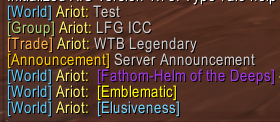
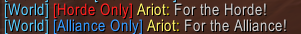
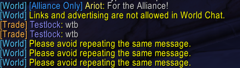

# This is a module for  AzerothCore

# Enhanced World Chat


---

## Description

**Enhanced World Chat** is a modern global chat module for AzerothCore designed to feel like a natural extension of Blizzard's chat system.

Unlike traditional world chat modules, Enhanced World Chat includes persistent World Chat mode, Blizzard hyperlink support, configurable spam protection, duplicate detection, URL filtering, automatic Trade/LFG tagging, ignore-list integration, and a public API for other modules.

Everything is configurable through `WorldChat.conf`.

---

## Requirements

Requires a current AzerothCore installation.

---

# Features

- Cross-faction World Chat
- Persistent World Chat Mode (`.world`)
- Saved player preferences
- Join World Chat using `/join World`
- Blizzard hyperlink support
- Ignore list integration
- Duplicate message detection
- Flood protection
- URL / advertising filter
- Automatic Trade message detection
- Automatic Dungeon Finder / Group detection
- Horde-only broadcasts
- Alliance-only broadcasts
- GM announcements
- Minimum player level
- Configurable colors and tags
- Full API for other modules
- Lightweight with minimal overhead

---
# Screenshots

| World Chat / Auto Detect Taggging | Faction Only for GMs |
|:-----------:|:-------------------:|
|  |  |

| Link Blocking and Spam Protection |
|:---------------:|
|  |


# Commands

## Player Commands

| Command | Description |
|---------|-------------|
| `.world <message>` | Send a World Chat message |
| `.world` | Toggle World Chat Mode |
| `.world on` | Enable World Chat |
| `.world off` | Disable World Chat |
| `.world status` | Display current World Chat settings |
| `/join World` | Join World Chat like a normal channel |

---

## Staff Commands

| Command | Description |
|---------|-------------|
| `.worldgm <message>` | Broadcast a server announcement |
| `.worldh <message>` | Horde-only World Chat |
| `.worlda <message>` | Alliance-only World Chat |

Staff members always receive faction-restricted messages to simplify moderation.

---

# Advanced Features

## Persistent World Chat Mode

Simply type:

```text
.world
```

Every normal `/say` message will now be redirected into World Chat until disabled.

---

## Hyperlink Support

Enhanced World Chat preserves Blizzard hyperlinks.

Supports:

- Items
- Spells
- Achievements
- Quests
- Enchants
- Glyphs
- Recipes
- Player Links

Players can Shift-Click links exactly as they would in normal chat.

---

## Automatic Chat Detection

Trade messages are automatically tagged.

Example:

```text
[Trade] Ariot: WTS [Betrayer of Humanity]
```

Group finder messages are automatically detected.

Example:

```text
[Group] Ariot: LFM ICC 25 Need Healer
```

Both features can be enabled or disabled independently.

---

## Spam Protection

Built-in flood protection includes:

- Configurable warning threshold
- Temporary automatic mute
- Duplicate message detection
- URL / advertising blocking

GM accounts are automatically exempt.

---

## Ignore Support

Enhanced World Chat respects the normal Blizzard ignore list.

If a player is ignored, their World Chat messages are hidden automatically.

---

## Public API

Other AzerothCore modules can broadcast through World Chat.

Examples:

```cpp
WC::Broadcast("Server restart in 10 minutes.");

WC::Broadcast(WC::MessageChannel::Announcement,
              "Icecrown Citadel is now open!");

WC::Broadcast(WC::MessageChannel::Trade,
              "Auction House weekend has begun.");

WC::Broadcast(WC::MessageChannel::Group,
              "Dungeon Bonus Event is active.");

WC::SendToPlayer(player,
                 WC::MessageChannel::Announcement,
                 "Your companion has gained a level.");

WC::SendToFaction(TEAM_HORDE,
                  WC::MessageChannel::Announcement,
                  "Wintergrasp begins in 10 minutes.");

WC::SendToGMs(WC::MessageChannel::GM,
              "AntiCheat detected suspicious movement.");
```

---

# Configuration

Every feature can be enabled or disabled.

Examples:

```ini
WorldChat.Enable = 1
WorldChat.CrossFaction = 1

WorldChat.IgnoreSupport = 1

WorldChat.DuplicateDetection = 1
WorldChat.UrlFilter = 1

WorldChat.TradeDetection = 1
WorldChat.GroupDetection = 1

WorldChat.MinimumLevel = 10
```

---

# Installation

```
1. Place the module inside the AzerothCore modules directory.
2. Import the SQL into the Characters database.
3. Re-run CMake.
4. Compile AzerothCore.
5. Copy WorldChat.conf.dist to your configuration folder.
6. Restart the server.
```

---

# Why Enhanced World Chat?

Enhanced World Chat was designed with two goals:

- Feel like Blizzard built it.
- Be easy for server owners to configure.

Rather than simply forwarding chat messages, it provides a complete communication framework that other AzerothCore modules can use through its public API.

---

# Credits

Original World Chat concept:

- Ouizzy
- Wizzymore

Enhanced World Chat:

- Expanded and modernized with persistent chat mode, API support, hyperlink preservation, ignore integration, automatic message classification, configurable filtering, and moderation tools.

Special thanks to the AzerothCore community for providing the foundation that makes modules like this possible.

---

# License

GNU AGPL v3
